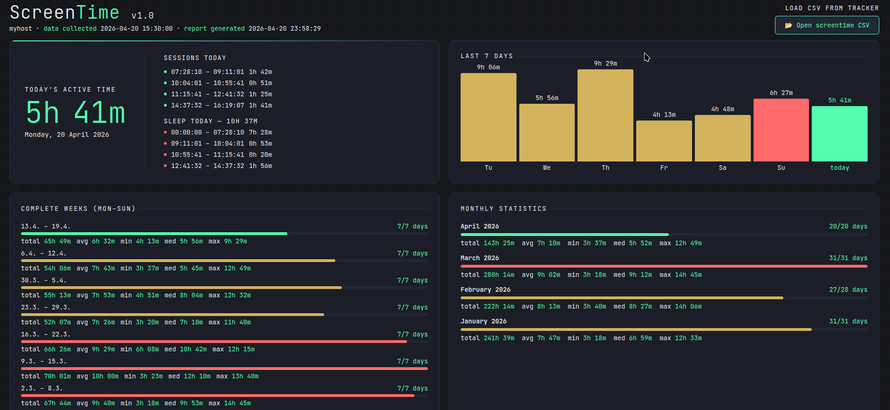

# linux-screentime

Track active (non-sleep) screen time on Linux by reading systemd journal suspend/resume events. Produces a CSV log, a color-coded terminal report, and a self-contained HTML dashboard.

## How it works

Linux logs every suspend and resume event in the systemd journal. `screentime-tracker.sh` reads these events, pairs them into active sessions, and correctly handles:

- Systems running for days without a reboot
- Sessions that cross midnight
- Days with no suspend events (system ran continuously)

## Requirements

- Linux with systemd (tested on Fedora 42)
- Python 3.6+
- `journalctl` and `last` (standard on all systemd distros)

## Quick start

```bash
git clone https://github.com/jirka-h/linux-screentime.git
cd linux-screentime
./screentime-tracker.sh
```

This reads the systemd journal, prints a terminal report, and generates `screentime-report.html` — open it in any browser for an interactive dashboard.

## Usage

```
Usage: screentime-tracker.sh [OPTIONS] [CSV_FILE]

Options:
  -h, --help      Show this help message
  --report        Show text report and generate HTML from existing CSV

Arguments:
  CSV_FILE        Path to CSV file (default: screentime-log.csv)
```

### Default (no options)

Reads the systemd journal, writes `screentime-log.csv` and `screentime-report.html`, and prints the terminal report:

```bash
./screentime-tracker.sh
```

### Report only (skip data collection)

Generates the text report and HTML dashboard from an existing CSV without re-reading the journal:

```bash
./screentime-tracker.sh --report
```

### Custom CSV path

All modes accept an optional CSV file path:

```bash
./screentime-tracker.sh --report /path/to/screentime-log.csv
```

The HTML report is written next to the CSV (e.g. `/path/to/screentime-log-report.html`).

## Terminal report

The text report includes:

- **Today** — total active time and sleep time with individual sessions
- **Last 7 days** — daily totals with per-active-day average
- **Complete weeks (Mon–Sun)** — total, avg, min, median, max per week; color-coded with red for the 3 worst weeks (most screen time) and green for the 3 best
- **Monthly statistics** — same stats per month, current month first

Sample output (generated from `test/sample-screentime-log.csv`):

```
====================================================
  SCREEN TIME REPORT  v1.0
====================================================

📅 TODAY (Monday, 20 Apr 2026)
   Active time: 5h 41m
     07:28:10 - 09:11:01  (1h 42m)
     10:04:01 - 10:55:41  (0h 51m)
     11:15:41 - 12:41:32  (1h 25m)
     14:37:32 - 16:19:07  (1h 41m)
   Sleep time:  10h 37m
     00:00:00 - 07:28:10  (7h 28m)
     09:11:01 - 10:04:01  (0h 53m)
     10:55:41 - 11:15:41  (0h 20m)
     12:41:32 - 14:37:32  (1h 56m)

📊 LAST 7 DAYS
   Tue 14       9h 06m
   Wed 15       5h 56m
   Thu 16       9h 29m
   Fri 17       4h 13m
   Sat 18       4h 48m
   Sun 19       6h 27m
   today        5h 41m
   Average      6h 31m  (active days: 7)

📅 COMPLETE WEEKS (Mon–Sun)
   13.4. – 19.4.        45h 49m  avg  6h 32m/day    (7/7)  min  4h 13m  med  5h 56m  max  9h 29m
   6.4. – 12.4.         54h 06m  avg  7h 43m/day    (7/7)  min  3h 37m  med  5h 45m  max 12h 49m
   30.3. – 5.4.         55h 13m  avg  7h 53m/day    (7/7)  min  4h 51m  med  8h 04m  max 12h 32m
   23.3. – 29.3.        52h 07m  avg  7h 26m/day    (7/7)  min  3h 20m  med  7h 10m  max 11h 40m
   16.3. – 22.3.        66h 26m  avg  9h 29m/day    (7/7)  min  6h 08m  med 10h 42m  max 12h 15m
   9.3. – 15.3.         70h 01m  avg 10h 00m/day    (7/7)  min  3h 23m  med 12h 10m  max 13h 40m
   2.3. – 8.3.          67h 44m  avg  9h 40m/day    (7/7)  min  3h 18m  med  9h 53m  max 14h 45m
   23.2. – 1.3.         63h 47m  avg  9h 06m/day    (7/7)  min  4h 30m  med  9h 42m  max 14h 06m
   16.2. – 22.2.        58h 31m  avg  8h 21m/day    (7/7)  min  3h 40m  med  9h 22m  max 11h 47m
   9.2. – 15.2.         54h 19m  avg  7h 45m/day    (7/7)  min  4h 12m  med  8h 17m  max  9h 46m
   2.2. – 8.2.          48h 09m  avg  8h 01m/day    (6/7)  min  5h 22m  med  8h 12m  max 11h 35m
   26.1. – 1.2.         50h 22m  avg  7h 11m/day    (7/7)  min  3h 55m  med  5h 58m  max 11h 18m
   19.1. – 25.1.        50h 57m  avg  7h 16m/day    (7/7)  min  4h 16m  med  6h 55m  max 10h 54m
   12.1. – 18.1.        63h 11m  avg  9h 01m/day    (7/7)  min  3h 18m  med  8h 58m  max 12h 24m
   5.1. – 11.1.         54h 56m  avg  7h 50m/day    (7/7)  min  3h 18m  med  6h 19m  max 12h 33m

📈 MONTHLY STATISTICS
   April 2026          143h 25m  avg  7h 10m/day  (20/20)  min  3h 37m  med  5h 52m  max 12h 49m
   March 2026          280h 14m  avg  9h 02m/day  (31/31)  min  3h 18m  med  9h 12m  max 14h 45m
   February 2026       222h 14m  avg  8h 13m/day  (27/28)  min  3h 40m  med  8h 27m  max 14h 06m
   January 2026        241h 39m  avg  7h 47m/day  (31/31)  min  3h 18m  med  6h 59m  max 12h 33m

====================================================
```

## HTML dashboard

Running `screentime-tracker.sh` generates a self-contained `screentime-report.html` — open it in any browser, no server needed.



The dashboard is a 2x2 grid:

| Today's active time | Last 7 days (bar chart) |
|---|---|
| Complete weeks (Mon–Sun) | Monthly statistics |

Features:
- Bar colors: green for today, red for Sunday, yellow for other days
- Week bars: red for 3 worst, green for 3 best, yellow for rest
- Month bars: red for worst, green for best, yellow for rest
- The template (`screentime-dashboard.html`) also supports loading any CSV via file picker

## Data window

Data collection covers the current month plus the 3 preceding full months (e.g. in April, data starts from January 1st), ensuring the monthly statistics section always shows 4 months.

## CSV format

```
# hostname: p1gen7
# collected: 2026-04-20 14:32:00
date,start_time,end_time,duration_seconds,type
2026-04-13,09:04:19,2026-04-13 22:30:00,48341,wake
2026-04-13,22:30:00,2026-04-14 07:59:24,34164,sleep
2026-04-14,07:59:24,2026-04-14 22:27:16,52072,wake
```

Each row is one session. The `type` column is `wake` (active screen time) or `sleep` (machine suspended). Sessions spanning midnight are stored with full start/end datetimes — both the terminal report and dashboard split them correctly per day.

## Adapting to other distributions

The script looks for these strings in the systemd journal:

| Event | Log message |
|---|---|
| Suspend | `The system will suspend now!` |
| Resume | `System returned from sleep operation` |

If your distribution logs different messages:
```bash
journalctl --since "7 days ago" -q --no-pager | grep -iE "suspend|sleep|wake|resume" | head -20
```

Then edit the `-g` pattern in `rebuild_log()` inside the script.

## Automating updates

Add a cron job to refresh the data daily:
```bash
crontab -e
```
```
0 6 * * * /path/to/screentime-tracker.sh
```

## License

MIT
